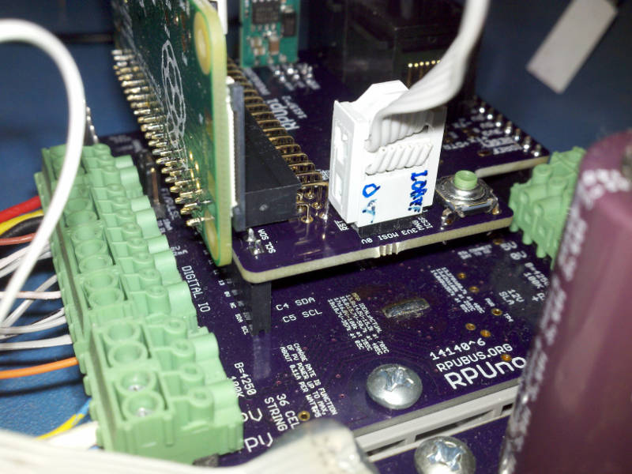
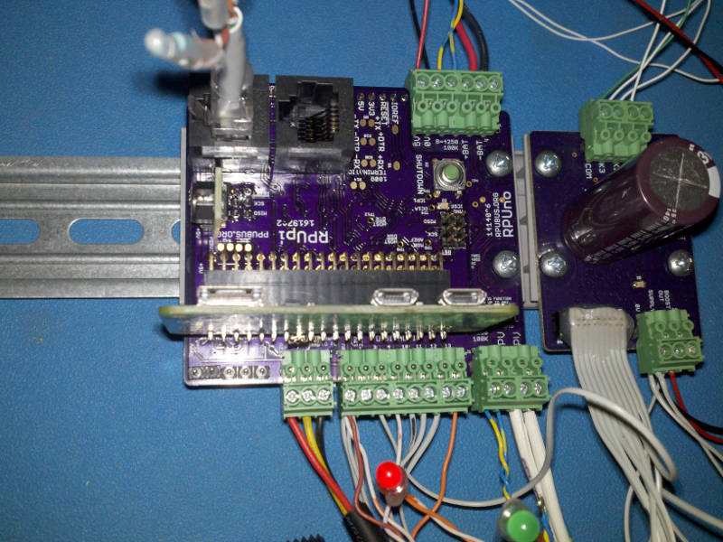
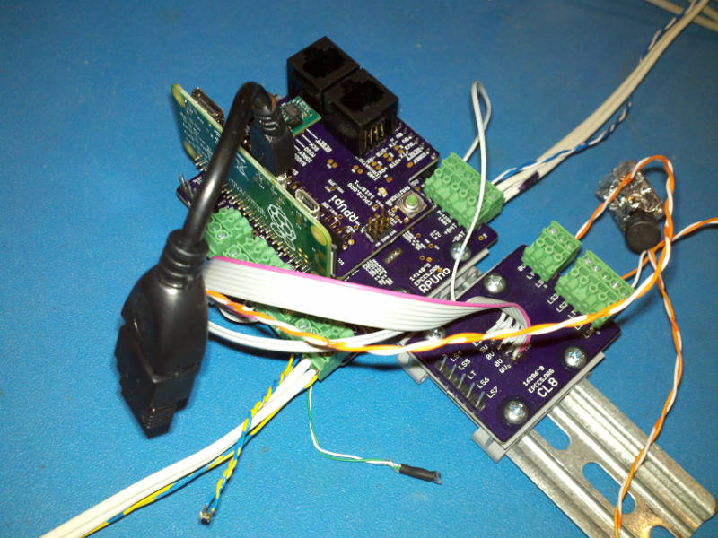
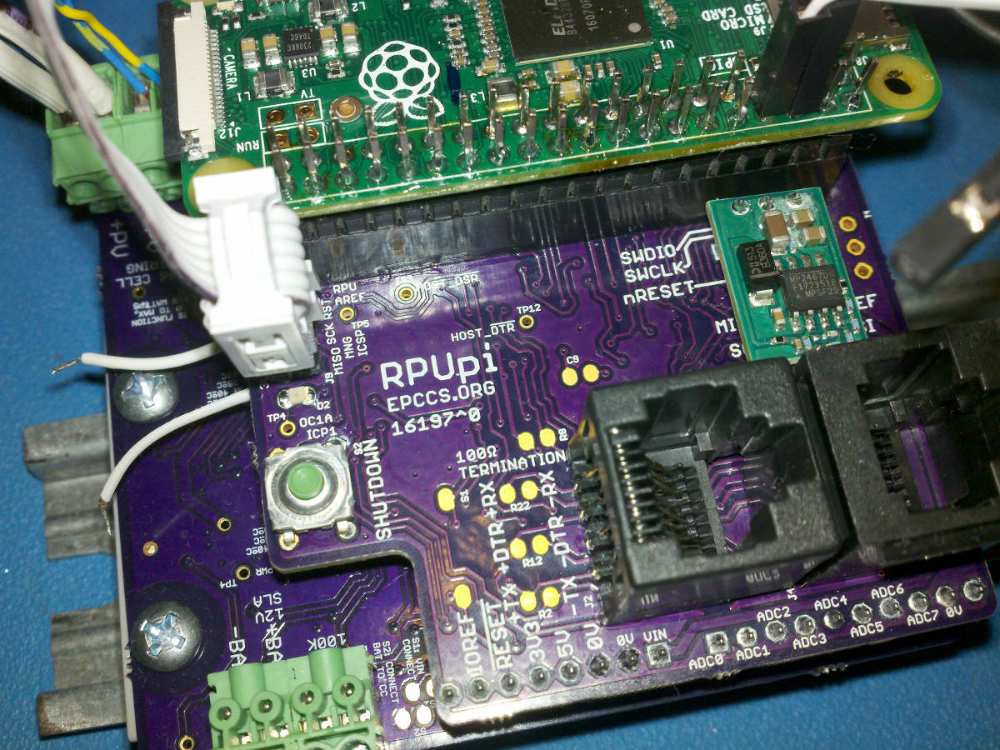

# Description

This shows the setup and method used for evaluation of RPUno.

# Table of References

# Table Of Contents:

4. ^2 Clearance IDE Connector For ICSP Tool
3. ^2 Clearance Between Pi and Plugable
2. ^1 Vertical Mounting
1. ^0 Mounting

## ^2 Clearance IDE Connector For ICSP Tool

ICSP tools normaly have an IDE connector, now it has room to fit.

## ^2 Clearance Between Pi and Plugable

The Pi does not overhang the plugable connectors now, but it is a tight fit.

## ^1 Vertical Mounting

Pinout was changed so the Pi Zero mounts vertically. The pluggable connectors on RPUno^5 can just barely be removed (or plugged in) with the Pi on the shield in. Take care when removing the Pi since the SD card and/or camera port of the Pi Zero can be damaged.

## ^0 Mounting

Show how this version of the shield mounts on a RPUno^4. 

