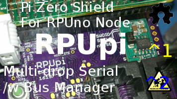
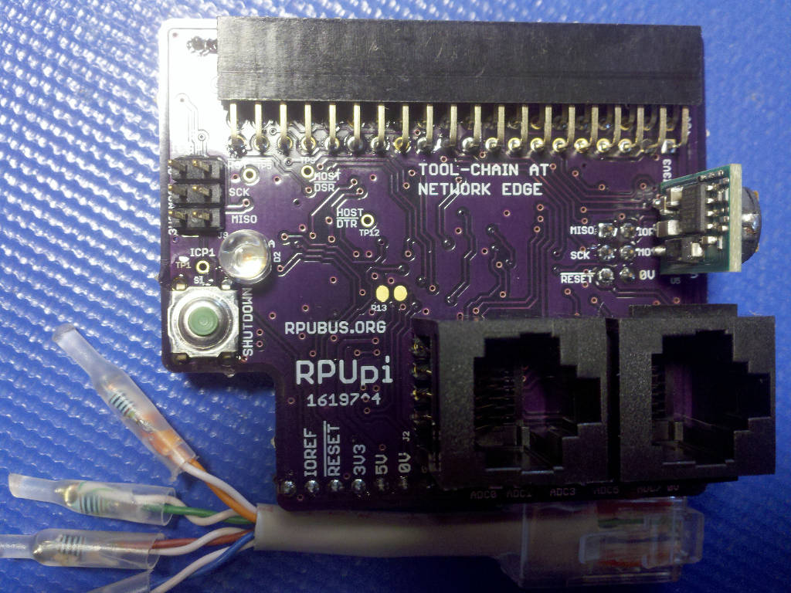
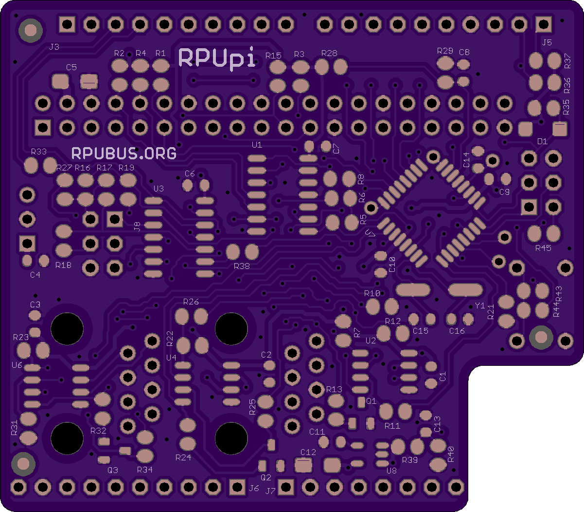
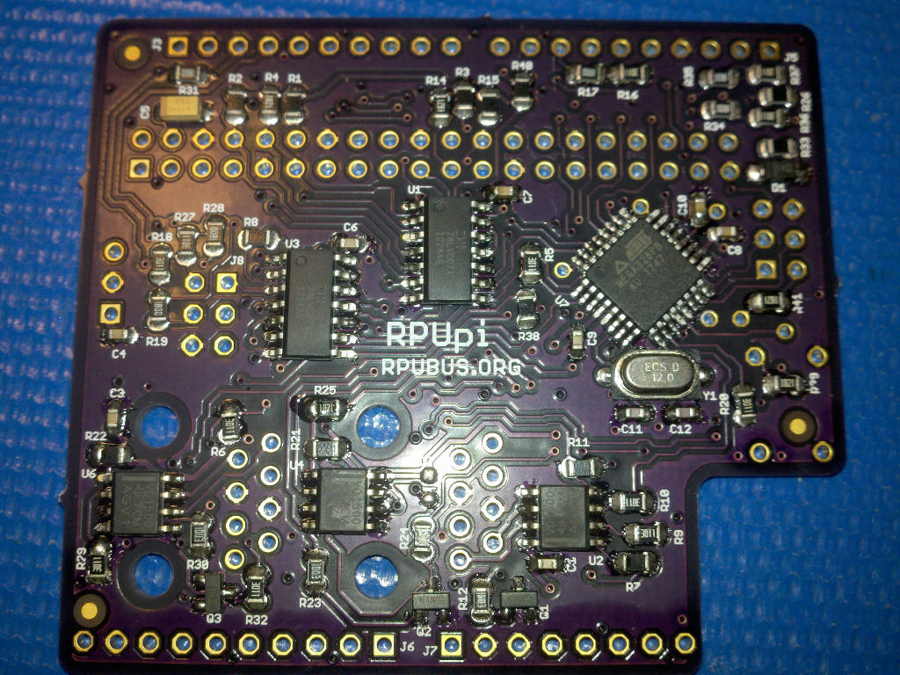
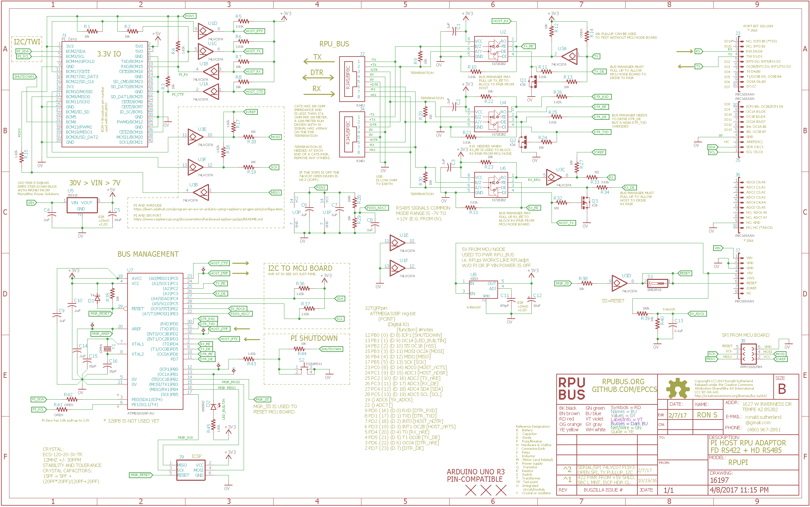
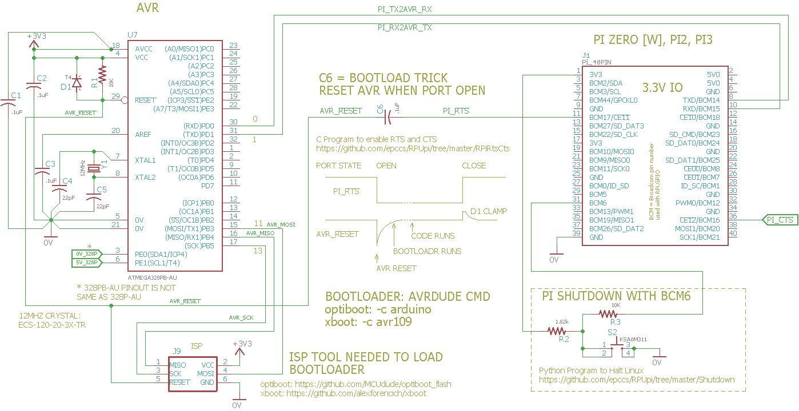
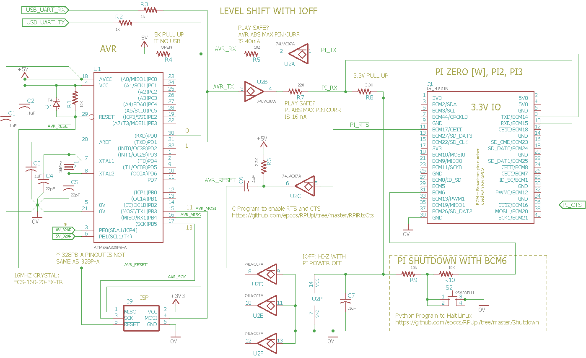

# Hardware

## Overview

This board connects a Pi Zero [W] to a multi-drop serial bus and a control board with a target (e.g. [RPUno], [RPUlux], [RPUicp], [Irrigate7]). 

[RPUno]: https://github.com/epccs/RPUno
[RPUlux]: https://github.com/epccs/RPUlux
[RPUicp]: https://github.com/epccs/RPUicp
[Irrigate7]: https://github.com/epccs/Irrigate7

## Inputs/Outputs/Functions

```
        Pi Zero power is from a 5V SMPS regulator powered by the Vin pin
        Pi Zero UART connects crossover style to the rpubus pairs
        rpubus pairs daisy-chain to other RPUpi or RPUadpt shields
        The UART's from multiple targets may connect to the rpubus pairs 
        An out of band management pair is used to control host to target (P2P) connection.
        SPI is available between SBC and the local target.
```

## Uses

```
        Raspberry Pi with a Raspian Linux instance is a compelling platform.
        Accessing the machine instance with SSH is prefered.
        Serving files with Samba is availalbe, but not prefered.
        The machine instance has a physical serial link (rpubus ) to the bare metal targets.
```

## Notice

```
        If the Pi Zero bootloads its local board (the one under the RPUpi) then 
        the VIN power from the local board must not turn off after a reset 
        (he defaut setup has been tested and works). 
 ```


# Table Of Contents

1. [Status](#status)
2. [Design](#design)
3. [Bill of Materials](#bill-of-materials)
4. [How To Use](#how-to-use)


# Status



```
        ^4  Done: Design, Layout, BOM, Review*, Order Boards, Assembly,
            WIP: Testing,
            Todo: Evaluation.
            *during review the Design may change without changing the revision.
            IOREF is for I2C and UART
            SPI_IOREF is for SPI only
            Add SPI nSS so the Raspery Pi CE10 can use it, (it was tested with RPUadpt^6)
            remove ADC6 and ADC7.
            remove smd mounts for 100 Ohm pair termination.
            Use TI's 5V THVD1500, wich cost less and has better specs.
            Run Manager at 5V to match trancever's.
            Remove 3V3 regulator, which is no longer needed.
            Change Q1..Q3 to use K1N. 

        ^3  Done: Design, Layout, BOM, Review*, Order Boards, Assembly, Testing,
            WIP: Evaluation.
            Todo: 
            *during review the Design may change without changing the revision.
            I2C added 182 Ohm between shield pins and bus manager
            RS-422 Buffer has Power (power U3 with +3V3) 
            Swaped U3E and U3F with U1E and U1F.
            Through hole LED so it can be moved outside the enclosure.

        ^2  Done: Design, Layout, BOM, Review*, Order Boards, Assembly, Testing,
            WIP: Evaluation.
            location: 2017-5-26 Test Bench, hacked U3 to power serial buffers witout Pi.

        ^1  Done: Design, Layout, BOM, Review*, Order Boards, Assembly, Testing,
            WIP: Evaluation.
            location: 2017-2-6 Test Bench, used as an RPUadpt with an RPUno^4.
            location: 2017-4-11 Scrap (in que, some parts salvaged 2017-7-18).
```

Debugging and fixing problems i.e. [Schooling](./Schooling/)

Setup and methods used for [Evaluation](./Evaluation/)


# Design

The board is 0.063 thick, FR4, two layer, 1 oz copper with ENIG (gold) finish.







## Electrical Parameters (Typical)

```
        VIN pin needs 7V to 30V (RPUno has 12.8V) at up to 4W for SMPS regulator to power a Pi Zero
        5V pin needs 150mA (RPUno has 1+ Amp) to power RPU_BUS
```

## Mounting

```
        Shield or Mezzanine
```

## Electrical Schematic



## Testing

Check correct assembly and function with [Testing](./Testing/)


# Bill of Materials

The BOM is a CVS file, import it into a spreadsheet program like LibreOffice Calc (or Excel), or use a text editor.

Option | BOM's included
----- | ----- 
A. | [BRD] 
M. | [BRD] [SMD] [HDR] 
N. | [BRD] [SMD] [HDR] [POL]
Y. | [BRD] [SMD] [HDR] [POL] [CAT5]

[BRD]: ./Design/16197BRD,BOM.csv
[SMD]: ./Design/16197SMD,BOM.csv
[HDR]: ./Design/16197HDR,BOM.csv
[POL]: ./Design/16197POL,BOM.csv
[CAT5]: ./Design/16197CAT,BOM.csv


# How To Use

Your [Raspberry Pi] is your computer, you are the expert because I surely am not. Don't buy an RPUpi board and expect that I can help with your computer, I can not. So far I have found that SSH works and the AVR toolchain, so I am able to serial bootload the  ATmega328p, ATmega328pb, and ATmega1284p. I have tested SMBus and found it works but it does not do repeated starts or clock stretching, so let's not call it I2C. I have also tested SPI somewhat. The serial console program I use is picocom, the install package is built to do standard baud rates so that is what I have been using. 

[Raspberry Pi]: https://www.raspberrypi.org/forums/

## Simplified Serial

To allow a hardware UART on a Raspberry Pi Single Board Computer to interface with an AVR UART the following connections can be used. Notice that the AVR is powered by 3.3V.



Next, lets set things up to use an AVR at 5V. Using a buffer with IOFF for level shifting. Now I can turn off the SBC without locking (pulling down) the serial port lines (e.g. to the USB UART bridge).



## ICSP

[ArduinoISP] sketch on an [Uno] with an SPI level converter (not needed for ^4 since it is 5V) is the [ICSP] tool I use to program the bus manager with the [Host2Remote] firmware. I then plug the RPUpi onto a target board and load my application firmware (e.g. target [RPUno] can run [Solenoid] to control a [K3] board). The RPUpi's SBC host can communicate via serial with other target boards that have an [RPUadpt] or RPUpi. The additional boards will need the [Remote] firmware on their bus manager and have a unique rpu_bus address set in EEPROM.

[ArduinoISP]: https://github.com/arduino/Arduino/blob/master/build/shared/examples/11.ArduinoISP/ArduinoISP/ArduinoISP.ino
[Uno]: https://www.adafruit.com/product/50
[ICSP]: https://github.com/epccs/Driver/tree/master/ICSP
[Host2Remote]: ../Host2Remote
[Remote]: https://github.com/epccs/RPUadpt/tree/master/Remote
[Solenoid]: https://github.com/epccs/RPUno/tree/master/Solenoid
[K3]: https://github.com/epccs/Driver/tree/master/K3
[RPUadpt]: https://github.com/epccs/RPUadpt

## Pi Zero Setup 

The Pi Zero is a Single Board Computer (SBC) running [Linux]. I use it as a network machine to run a toolchain at the network edge. It has enough memory and processing power for the AVR toolchain (and others that I have not tested). It also does self-hosted compiling for (e.g. compiles programs to run on itself) and has lots of applications and services (node.js, mosquitto...). My use is sort of like a headless test bench computer embedded next to the bare metal control boards, I daisy-chain its serial to each target I want to bootload. Is it IoT, no it is not, it is a classic control system (but it is headless). So far I interact with the target boards with an SSH session and then using picocom, I am less sure that is going to change with each passing year. 

[Linux]: ./Testing/linux.md

The BCM2835 Broadcom chip used in the Raspberry Pi Zero is an ARM11 running at 1 GHz it has good support with the [Raspbian] distribution. 

[Raspbian]: https://www.raspbian.org/


## Serial

The Pi serial port (RX is BCM 15 and TX is BCM 14) is crossover connected at the transceivers that drive the differential pairs and then connect to the shield's target header for Tx and Rx e.g. BCM Rx goes through a transceiver to the target's Tx pin on the shield. This allows the SBC to talk to the shield's target with serial as is expected as well as being copied to the other transceivers connected to the differential pairs. 


The Pi's handshake lines nCTS and nRTS lines are on BCM 16 and 17 when the ALT3 option is active. BCM 17 is on the original 26 pin Pi connector, but BCM 16 is on the new 40 pin connector (e.g. use a 40 pin model). I use this [rpirtscts] program as a command-line utility for enabling hardware flow control on the Pi Zero serial port. 

[rpirtscts]: https://github.com/epccs/RPUpi/tree/master/RPiRtsCts

On the RPUpi board, the Pi Zero serial lines (Rx, Tx, nRTS, and nCTS) have been interfaced through a 74LVC07A buffer which is powered from the Pi's 3V3 power. When the Pi Zero is powered off the IOFF feature of the buffer will hi-z the output (it's an open collector output) which will allow a pull-up to set the proper value on nRTS and the Tx line. This allows the RPU_BUS to be used when the Pi Zero is powered off (or not plugged in). Also, a 74LVC07A buffer is used between the transceiver and the shield so the MCU on the shield can run at 3.3V or 5V, this buffer is powered from the shield so the shield UART can talk on the serial bus without the SBC.

When the Pi's handshake lines are enabled the nRTS line is used to start a targets bootloader (e.g. the famous Arduino DTR trick). When avrdude opens the serial port the nRTS goes active, that is it pulls low and is coupled through a capacitor to the Uno nREST pin, and bang the bootloader runs. In this case, the bus manager sees nRTS and broadcast a bootload address on the out of band channel so avrdude sees a single target running its serial bootloader. Since picocom does the same thing I have to make sure the target is one I want to reset, and then have to wait for that targets bootloader to timeout and its application to get the bus address from its shield. 


## Full Duplex Serial Management

The shield has a bus manager, through its example firmware is ongoing. It has access to enable/disable each transceiver receiver and/or driver. This means that each (or all) targets can be isolated from the serial bus, the implications are significant. The original intent was to allow boot loading with a point to point full duplex mode (e.g. target with optiboot/xboot and the host running avrdude). The reason Arduino Uno is amazing is that it allows boot loading a new executable binary image over a severely goofed up the bare metal application, the rpubus tries to retain the nearly bulletproof upload. 


## Transceiver (RS-485)

The transceivers used have a built-in fail-safe bias, which is a little complicated to explain, but it makes an undriven bus (e.g. 0V or the failed condition) a defined state (true or HIGH). That is if I turn off the transceiver driving the bus (only one should drive the bus at any time), it is guaranteed to be in a defined state (e.g. HIGH). I have set up the transceivers to automatically turn off the driver while the UART output is a true (since HIGH is its default value). That means the driver will automatically drive the bus only when data is sent, so nothing needs to be done in software to turn on or off the transceivers. The bus manager may override. 

## SPI

The SBC's SPI lines (MOSI, SCK, MISO, ^4 adds nSS) are interfaced through a 74LVC07A buffer. The lines MOSI, SCK, and nSS are powered from the SBC 3V3 power. When the SBC is powered off the IOFF feature of the buffer will hi-z its open collector output which will allow a pull-up to set the value on SCK and the MOSI line or allow the shield MCU to control them. 

Known issues: RPUno has its SPI lines run to user connectors for digital control so make sure those are free if SPI is to be used.

## I2C

The SBC has an SMBus port when it is running Linux, it is not actually I2C. It is not clear if anyone has ever done reliable I2C on a time-sharing operating system. The Raspberry Pi Zero has 1.8k pull-ups to 3.3V, and when it is powered down those resistors pull down the I2C lines and lock the bus. That is why the ^4 manager is an ATmega328pb. The second I2C port can talk to the SBC with SMBus commands, and the original I2C port can talk to the target.


## SD

SBC SD Card [corruption] seems to happen when the SD card is doing wear leveling operations at the time power is removed. It is possible with this setup to push the shutdown button and have that run a [Shutdown] script. In addition, the target can initiate a power down with [PwrMgt] which monitors power before killing power to the shield (VIN pin). The idea is that wear leveling will draw current somewhat randomly until all the page updates are done. The BCM2835 will be halted, and looping (it is checking one of the I2C pins) and using a steady current draw. So when the current draw is stable the wear leveling should be done and safe to disconnect the shield VIN.

[Shutdown]: https://github.com/epccs/RPUpi/tree/master/Shutdown
[PwrMgt]: https://github.com/epccs/RPUno/tree/master/PwrMgt
[corruption]: https://hackaday.com/2016/08/03/single-board-revolution-preventing-flash-memory-corruption/


## Security

One lesson I understand is to bootload bare metal over links that cannot have adversaries in the middle.


## Compiling

To prevent heap usage and its fragmentation on the AVR I use C and avoid the malloc function. This means only the stack and static memory is used. 

The AVR has a single clock domain (for the most part), so the GPIO, peripherals and flash memory operate in a predictable and repeatable way. That is to say, an AVR will pull an instruction from flash and run it to change an output in a predictable consistent way. A faster machine may need to buffer instructions from flash and will experience timing variations from branch test that follows a path into an empty instruction cache. There are other clock domain concerns that cause timing variability in fast devices that run with multiple clock domains (e.g. see [memory barrier]), but the point is that AVR is simple.

[memory barrier]: https://en.wikipedia.org/wiki/Memory_barrier

When a task is small and/or simple enough to be done with an AVR it takes less time and effort to just use an AVR. It uses the same GCC toolchain as the big boys (GCC also does x86, ARM, MIPS...), but the AVR is a simple device with a fraction of the documentation to understand (and the garden ain't going to eat itself... or wait actually it sort of does).
