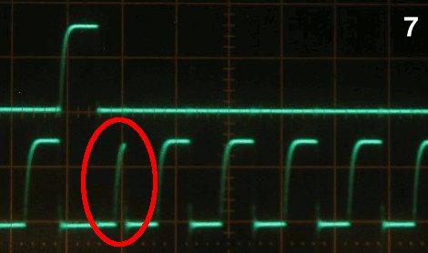
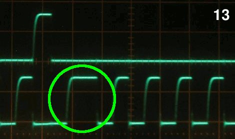

# Description

Some lessons I learned doing RPUpi.

# Table Of Contents:

1. ^5 SMBus Confusion
1. ^4 Bootload Speed
1. ^4 nSS to CE10 WTF
1. ^3 Connect nSS to SBC CE10
1. ^2 Protect I2C With 182 Ohm 
1. ^2 RS-422 Buffer needs Power
1. ^1 Serial When Powered Down
1. ^1 Pi Zero Placement
1. ^1 Open SCK and MOSI
1. ^1 Pi Tx Pull-Up
1. ^1 I2C
1. ^0 U3 Placed Backward


## ^5 SMBus Confusion

I have been using the Python write_i2c_block_data and read_i2c_block_data. It is from:

https://git.kernel.org/pub/scm/utils/i2c-tools/i2c-tools.git/

at this time the read function is at line 519.

https://git.kernel.org/pub/scm/utils/i2c-tools/i2c-tools.git/tree/py-smbus/smbusmodule.c#n519

Looking at the SMBus_read_i2c_block_data function, I see nothing about an OFFEST; in fact, I see nothing about OFFSET anywhere so I guess that idea was from looking at the smbus2 implementation which does say it is a drop-in replacement. Anyway, it is a command byte, not an offset; it is sent as data just before a repeated start after which the slave address is repeated and data bytes are read back. 

This is an example of reading a 32bit value from an SMBus device with Wire that I found.

```
uint32_t read32u(uint8_t device_comand)
{
	uint32_t registerValue;
      Wire.beginTransmission(I2C_Address);
	Wire.write(device_comand);
	Wire.endTransmission();
	Wire.requestFrom(I2C_Address,4,true);
	registerValue = Wire.read();
        registerValue |= (Wire.read()<<8);
        registerValue |= (Wire.read() << 16);
        registerValue |= (Wire.read() << 24);
	Wire.endTransmission();
        return registerValue;
}
```

My thinking is that a write_i2c_block_data(42, 192, [1]) does this. 

``` 
/1/iaddr 42
{"address":"0x2A"}
/1/ibuff 192,1
{"txBuffer[2]":[{"data":"0xC0"},{"data":"0x01"}]}
/1/iwrite
{"returnCode":"success"}
```

And that read_i2c_block_data(42, 192, 2) does this.

```
/1/ibuff 192
{"txBuffer[2]":[{"data":"0xC0"}]}
/1/iread? 2
{"rxBuffer":[{"data":"0xC0"},{"data":"0x01"}]}
```

Unfortunately, the return value is [64,0x1] shows that clock-stretching has corrupted that data. It is a known bug; the BCM2835 (e.g., R-Pi 0) picks up on a stretched clock only during the second half of the clock cycle. It only work at the end of I2C-read-ACK-phases (after reading ACK/NACK), not at the beginning. 



Clock-stretching at the end/directly after an I2C-read-ACK-phase only works correctly, if the slave stretches SCL by more than 0.5 I2C clock periods. 



http://www.advamation.com/knowhow/raspberrypi/rpi-i2c-bug.html

Linux notest:

https://git.kernel.org/pub/scm/linux/kernel/git/torvalds/linux.git/plain/Documentation/i2c/smbus-protocol

https://www.kernel.org/doc/Documentation/i2c/dev-interface

Some R-Pi notes:

https://www.raspberrypi.org/forums/viewtopic.php?f=44&t=15840&start=25

https://www.raspberrypi.org/forums/viewtopic.php?p=146272

Known bug?; the BCM2835 (e.g., R-Pi 0) picks up on a stretched clock only during the second half of the clock cycle. Hmm... so I could try a 10uSec delay in the receive event which is what causes clock stretching. I have an RPUno and RPUpi combination that seems to work over the SMBus, however after adding a delay in the slave events the working one has problems now. 

https://github.com/raspberrypi/firmware/issues/828

```
dtoverlay=i2c1-bcm2708,combine=no
```

```
sudo apt-get install python3-smbus i2c-tools
```

The package i2c-tools, for exampel "i2cdetect -r -y 1" can scan. Its man page is easy to read on the Linux machine but anyway.

https://git.kernel.org/pub/scm/utils/i2c-tools/i2c-tools.git/tree/tools/i2cdetect.8

```
     0  1  2  3  4  5  6  7  8  9  a  b  c  d  e  f
00:          -- -- -- -- -- -- -- -- -- -- -- -- --
10: -- -- -- -- -- -- -- -- -- -- -- -- -- -- -- --
20: -- -- -- -- -- -- -- -- -- -- 2a -- -- -- -- --
30: -- -- -- -- -- -- -- -- -- -- -- -- -- -- -- --
40: -- -- -- -- -- -- -- -- -- -- -- -- -- -- -- --
50: -- -- -- -- -- -- -- -- -- -- -- -- -- -- -- --
60: -- -- -- -- -- -- -- -- -- -- -- -- -- -- -- --
70: -- -- -- -- -- -- -- --
```

and "i2cdetect -F 1" will list of functionalities implemented by the adapter

```
I2C                              yes
SMBus Quick Command              yes
SMBus Send Byte                  yes
SMBus Receive Byte               yes
SMBus Write Byte                 yes
SMBus Read Byte                  yes
SMBus Write Word                 yes
SMBus Read Word                  yes
SMBus Process Call               yes
SMBus Block Write                yes
SMBus Block Read                 no
SMBus Block Process Call         no
SMBus PEC                        yes
I2C Block Write                  yes
I2C Block Read                   yes
```

The next man page I see has "i2cdump -V" and on my R-Pi zero it shows

https://git.kernel.org/pub/scm/utils/i2c-tools/i2c-tools.git/tree/tools/i2cdump.8

```
i2cdump version 3.1.2
```

But I don't see anything that looks like what I think SMBus_read_i2c_block_data does.  This "i2cdump 1 0x2a i" does not send a command byte.

The next man page I see is for "i2cget [-f] [-y] i2cbus chip-address [data-address [mode]]"

https://git.kernel.org/pub/scm/utils/i2c-tools/i2c-tools.git/tree/tools/i2cget.8

```
i2cget 1 0x2a 0x00
WARNING! This program can confuse your I2C bus, cause data loss and worse!
I will read from device file /dev/i2c-1, chip address 0x2a, data address
0x00, using read byte data.
Continue? [Y/n] Y
0x00
```

Another tool is i2ctransfer but it is not yet on the R-Pi.

https://git.kernel.org/pub/scm/utils/i2c-tools/i2c-tools.git/tree/tools/i2ctransfer.8

Also it does not do what I though SMBus_read_i2c_block_data does, sadness.

https://oscarliang.com/raspberry-pi-arduino-connected-i2c/

https://github.com/xmos/vocalfusion-rpi-setup/issues/13

Linux 4.19 will soon be the new OS, but it seems to have new or changed clock stretching problems with these BCM SoC. I need to try and do away with I2C clock stretching. I am going to try interleaving the buffer returned with the receive event, so the user will have to work with it befor the next receive event. The interleaving buffer will need to be added to the twi1.c lib file (e.g., a core file that is complex). While I was struggling with the SMBus, the Linux gurus are dealing with never-ending networking issues. 

https://news.ycombinator.com/item?id=20205566

How long before these updates are on the R-Pi? I don't know, but I do know that the R-Pi and Linux is not my product, and I will not provide support for them. The R-Pi will be the customer's computer, and they are responsible for keeping it up to data and making it work on their network if that sounds like attitude then sorry, guess I struggled with SMBus for too long.


## ^4 Bootload Speed

I have been using Optiboot at 115.2k bps but was not able to do that reliably with picocom (or any other serial). I think it was just on the edge of working with the 3172EIBZ at both ends, but placing the THVD1500 at one end adds to much delay so the THVD1500 and AVR UART clock at 111.1k bps is not able to work reliably with the 3172EIBZ and FTDI UART at 115.2k. 

Changing the AVR to 38.461k is a much better match to the FTDI's speed of 38.4k. I changed the speed for applications serial communication ages ago, and that has been reliable. Communication at 115.2k bps with picocom was getting the wrong values back so I have been confused for some time about the magic trick optiboot and avrdude were doing, I have dug through the source somewhat but did not see anything obvious so this is frankly comforting to see. 

Arduino's Uno is living on a bootload speed edge, I guess it works for them but I want a robust serial link for both communication and bootload. This will make my boards less compatible with Arduino's, but [MiniCore] can be used on there IDE and it has a 38.4k bps Optiboot. Now that I have seen this issue I will move my other boards to this speed also. Note that I am not using the Arduino IDE, the makefile is used in its place, it has the rules used to build the software so I can build the firmware remotely over an SSH login. 

[MiniCore]: https://github.com/MCUdude/MiniCore


## ^4 nSS to CE10 WTF

No no no... that is not what was tested, it was tested with nCE00 the RPUadpt test setup photo clearly shows it was nCE00. So I assembled one ^4 board and will rework it then finish testing.


## ^3 Connect nSS to SBC CE10

When SPI uses chip enable it tells the slave to start a transaction, and the slave can align the data to the start.

This was tested with RPUadpt^6, and needs added to the next revision.


## ^2 Protect I2C With 182 Ohm

Add 182 Ohm in-line between shield pins and bus manager.


## ^2 RS-422 Buffer needs Power

When U3 (74LVC07) does not have power the serial RX and TX from shield can not reach RS-422 transceivers. 

For testing, I need to cut U3 power from the PI3V3 node and bridge it to +3V3 node.


If U3E and U3F can be flipped with U1E and U1F that would also be helpful, U3B is fine as is.


## ^1 Serial When Powered Down

When the Pi is powered down the nRTS line, which is active low seems to become active. Also, HOST_TX pulls down and causes a bus lock-up. Finally nCTS, HOST_RX sinks too much current from the transceivers without some sort of protection when Pi is powered down.

 Another 74LVC07 with Pi as target is needed to fix all this.


## ^1 Pi Zero Placement

The Pi Zero fits but if it can be moved in that would be helpful. I think the SMPS can rotate and I can ditch the SWD port.


## ^1 Target Should Power 74LVC07 

In this case the Pi is the target, and it should power the 74LVC07 buffer I used for level shifting. If the target is off it disables the IC (and the open drain is hi-z). If the target has 3.3V the IC is on and tolerant of 5V on its inputs. The outputs can be pulled up to 5V or 3.3V as needed. Also the inputs are tolerant of 5V when power is off.


Note: I am using the term target sort of like how I view ICSP, which is to say the thing that will get powered off. In this case oddly enough the bare metal  board (RPUno) will not power off, and is therefor not what I'm calling the target (I need to find a better way to say this...).


## ^1 Open SCK and MOSI

The 74LVC07 can damage the AVR by sinking current, therefore I need to open these traces and place a 10k Ohm resistor. This will allow the AVR to drive without causing damage when the 74LVC07's open drain output is sinking.


Some nasty rework to add the 10k for more evaluation.


## ^1 Pi Tx Pull-Up

Add a 10k pull up to the Pi Zero Tx line. This will automatically disable the transceiver driver when the Pi is not powered or is absent.


## ^1 I2C

Cut I2C from Pi Zero and use a 1.8k pull-up to the bus manager 3V3. I am using I2C between the RPUno and bus manager to pass the rpu_bus address, I would prefer the RPUno programs work with an RPUpi shield without change. So the I2C from Pi to bus manager needs removed. Also when the RPUno kills power to the Pi that will pull down the I2C lines and block the bus manager from I2C communication with the RPUno.


## ^0 U3 Placed Backward

I though the via was my mark for pin one, need to fix the packages so this does not happen again.


