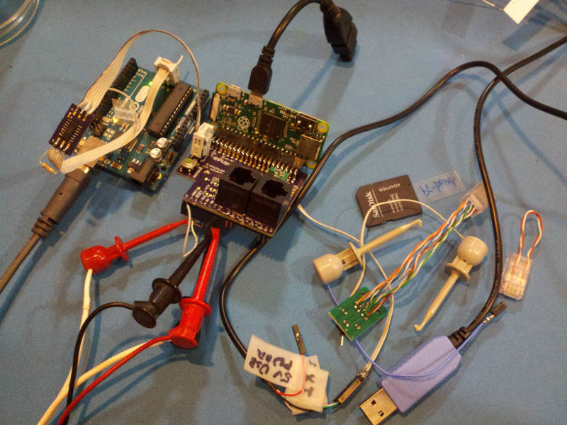
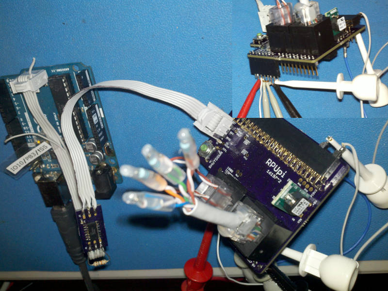

# Description

This is a list of Test preformed on each RPUpi after assembly.

# Table of References


# Table Of Contents:

1. Basics
2. Assembly check
3. IC Solder Test
4. Bias +5V
5. Set MCU Fuse
6. Load CheckDTR Firmware
7. Check Differential Bias
8. Differential Loopback with TX Driver
9. Differential Loopback with RX Driver
10. Bias VIN and Check +5V_2PI from SMPS
11. Host Lockout
12. Pi Zero without SD card
13. Boot Headless Pi Zero
14. SPI 


## Basics

These tests are for an assembled RPUpi board 16197^4 which may be referred to as a Unit Under Test (UUT). If the UUT fails and can be reworked then do so, otherwise it needs to be scraped. 

**Warning: never use a soldering iron to rework ceramic capacitors due to the thermal shock.**
    
Items used for test.




## Assembly check

After assembly check the circuit carefully to make sure all parts are soldered and correct. The device marking is used as the part name on the schematic and assembly drawing. Check the bill of materials to figure out what the device is.


## IC Solder Test

Check continuity between pin and pad by measuring the reverse body diode drop from 0V (aka ground) and all other IC pads not connected to 0V. This value will vary somewhat depending on what the pin does, but there is typically an ESD diode to ground or sometimes a body diode (e.g. open drain MOSFET), thus a value of .4V to .7V is valid to indicate a solder connection. Note the RS485 drivers will show high impedance on the differential lines, so skip those.


## Bias +5V


Apply a 30mA current limited (CC mode) supply set at 5V to the +5V (J7 pin 4) and 0V (J7 pin 2) header pins. Check that the input current is for the blank MCU. Turn off power.

```
^5 
{  "I_IN_BLANKMCU_mA":[4.2,] }
^4 removed LDO
{  "I_IN_BLANKMCU_mA":[5.2,] }
^3
{  "I_IN_BLANKMCU_mA":[2.1,1.8,2.2,2.2,],
    "LDO_V":[3.302,3.282,3.276,3.292,] }
```


## Set MCU Fuse

Install Git and AVR toolchain on Ubuntu (I use 18.04). 

```
sudo apt-get install git make gcc-avr binutils-avr gdb-avr avr-libc avrdude
```

Clone the RPUpi repository.

```
git clone https://github.com/epccs/RPUpi
cd RPUpi/Bootload
```

Connect a 5V supply with CC mode set at 30mA to the +5V (J7 pin 4) and  0V (J7 pin 2). Connect the ICSP tool (J9). The MCU needs its fuses set, so run the Makefile rule to do that. 

```
make fuse
```

Note: There is not a bootloader, it just sets fuses.

Disconnect the ICSP tool and measure the input current for 12Mhz crystal. It takes a long time to settle.

```
^5
{  "I_IN_MCU_12MHZ_LP-CRYSTAL_mA":[13.8,]}
^4
{  "I_IN_MCU_12MHZ_LP-CRYSTAL_mA":[14.9,]}
^3
{  "I_IN_MCU_12MHZ_LP-CRYSTAL_mA":[4.9,5.1,5.0,5.1,]}
```


## Load CheckDTR Firmware

Plug a header (or jumper) onto the +5V pin so that IOREF is jumpered to +5V, also jumper it to SPI_IOREF (J8 pin 2) with ez-hook. Connect TX pin to IOREF to pull it up (the RPUno/Irrigate7 normaly does his). Plug a CAT5 RJ45 stub with 100 Ohm RX, TX and DTR pair terminations. Connect the 5V supply with CC mode set at 90mA to the +5V (J7 pin 4) and  0V (J7 pin 2). Connect the ICSP tool (J9).

Use the command line to select the CheckDTR source working directory. Run the makefile rule used to load CheckDTR firmware that verifies DTR control is working:

```
cd ~RPUpi/CheckDTR
make isp
```

The program loops through the test. It blinks the red LED to show which test number is setup. If it keeps repeating a test then that test has failed.

As the firmware loops, the input current can be measured, it should have two distinct levels, one when the DTR pair is driven low and one when the DTR pair is not driven. The blinking LED leaves the DMM unsettled. Turn off the power.

```
^5
{  "DTR_HLF_LD_mA":[49.7,],
    "DTR_NO_LD_mA":[21.4,] }
^4
{  "DTR_HLF_LD_mA":[35.6,],
    "DTR_NO_LD_mA":[19.9,] }
^3
{  "DTR_HLF_LD_mA":[33.4,33.8,33.6,33.7,],
    "DTR_NO_LD_mA":[10.0,10.5,10.5,10.5,] }
```

Note: the ICSP tool is pluged in and has some pullups with the level shift.


## Check Differential Bias

Plug a header (or jumper) onto the +5V pin so that IOREF is jumpered to +5V. Plug a CAT5 RJ45 stub with 100 Ohm RX, TX and DTR pair terminations. Connect TX pin to 0V to pull it down to simulate the MCU sending data. Connect a 5V supply with CC mode set at 100mA to the +5V that was jumpered to IOREF (J8 pin 2) and 0V (J7 pin 2).


Hold down the shutdown switch while running the CheckDTR firmware to set TX_DE and RX_DE high.

Check  that the input current is cycling with a lower value and higher value. At the higher value is when the TX driver is driving the TX pair with half load and DTR driver is driving the DTR pair with a half load, while ony the TX pair is driven at the lower value. 

```
^5
{  "DTR_TX_HLF_LD_mA":[78.9,],
    "TX_HLF_LD_mA":[50.1,] }
^4
{  "DTR_TX_HLF_LD_mA":[50.5,],
    "TX_HLF_LD_mA":[35.0,] }
^3
{  "DTR_TX_HLF_LD_mA":[56.0,56.9,57.0,56.8,],
    "TX_HLF_LD_mA":[33.0,33.7,33.7,33.7,] }
```


## Differential Loopback with TX Driver

Plug a header (or jumper) onto the +5V pin so that IOREF is jumpered to +5V. Plug a CAT5 RJ45 stub with 100 Ohm RX, TX and DTR pair terminations. Connect TX pin to 0V to pull it down to simulate the MCU sending data. Connect a 5V supply with CC mode set at 130mA to the +5V that was jumpered to IOREF (J8 pin 2) and 0V (J7 pin 2).

NOTE: IOREF J7 pin 4 is not connected

Connect a RJ45 loopback connector to allow the TX differential pair to drive RX differential pair and measure the input current. The TX driver is now driving 50 Ohms, which is the normal load. Verify that RX has 0V on it now.

```
^5
{  "DTR_HLF_LD_TX_FL_LD_mA":[97.9,],
    "TX_FL_LD_mA":[69.3,] }
^4
{  "DTR_HLF_LD_TX_FL_LD_mA":[60.8,],
    "TX_FL_LD_mA":[45.7,] }
^3
{  "DTR_HLF_LD_TX_FL_LD_mA":[72.4,73.9,74.0,74.3,],
    "TX_FL_LD_mA":[49.1,50.7,50.9,51.0,] }
```

Turn off power.


## Differential Loopback with RX Driver

Continuing from previous test, now disconnect TX from ground and Connect it to IOREF, which will disable the TX driver (U2) so that the RX driver (U6) can operate through the RJ45 loopback. Keep the CAT5 RJ45 stub with 100 Ohm RX, TX and DTR pair terminations and the RJ45 loopback connector so the TX pair is looped back to the RX pair. 

Bias PI3V3 (J1 pin 1) with IOREF (The Pi will power this with 3.3V but it will work with the 5V on IOREF).

Connect PI_TX (J1 pin 8) to 0V (J1 pin 6) to cause the RX driver to drive the RX pair. 



Power on 5V supply at 100mA. Hold down the shutdown switch while running the CheckDTR firmware to set TX_DE and RX_DE high.

Measure the supply current when RX is driven and when a DTR half load is added.

```
^4
{  "DTR_HLF_LD_RX_FL_LD_mA":[107.7,],
    "RX_FL_LD_mA":[79.7,] }
^4
{  "DTR_HLF_LD_RX_FL_LD_mA":[67.8,],
    "RX_FL_LD_mA":[52.0,] }
^3
{  "DTR_HLF_LD_RX_FL_LD_mA":[83.3,88.0,88.3,88.0,],
    "RX_FL_LD_mA":[60.0,65.0,65.1,65.0,] }
```

Turn off power. Disconnect everything.


## Bias VIN and Check +5V_2PI from SMPS

Apply a 30mA current limited (CC mode) supply set at 12.8V to the VIN (J7 pin 1) and 0V (J7 pin 3) header pins. Measure the SMPS providing +5V_2PI (J1 pin 2). Check that the input current is for no load. Turn off power.

```
^5
TBD
^4
{  "VIN@NOLD_mA":[0.2,],
    +5V2PI_V":[4.97*,] }
^3 * same SMPS
{  "VIN@NOLD_mA":[0.2,0.2,0.2,0.2,],
    +5V2PI_V":[4.97*,4.99,5.00,5.00,] }
```

## Host Lockout

The Remote firmware will ignore the host nRTS signal until the status bit is cleared.

Plug an [RPUftdi] shield with [Host2Remote] firmware onto an [RPUno] or Uno board (not the UUT but a separate board) connect the USB to computer and load [I2C-Debug] on it. Note that the default bootload address allows this to work.

[RPUftdi]: https://github.com/epccs/RPUftdi
[Host2Remote]: https://github.com/epccs/RPUftdi/tree/master/Host2Remote
[RPUno]: https://github.com/epccs/RPUno
[I2C-Debug]: https://github.com/epccs/RPUno/tree/master/i2c-debug

```
cd ~RPUno/i2c-debug
make bootload
```

Use picocom to set the bootload address. The RPUftdi is at address 0x30 and the UUT will be at address 0x31.

```
picocom -b 38400 /dev/ttyUSB0
...
Terminal ready
/0/iaddr 41
{"address":"0x29"}
/0/ibuff 3,49
{"txBuffer":[{"data":"0x3"},{"data":"0x31"}]}
/0/iread? 2
{"rxBuffer":[{"data":"0x3"},{"data":"0x31"}]}
```

Exit picocom (Cntl^a and Cntl^x). 

Plug the UUT (the [RPUpi] shield) onto a second RPUno board. Connect the ICSP tool to UUT (J9). Power the RPUno (e.g. connect supply set with 12.8V at 180mA CC).

Load the Remote firmware onto UUT. Use the command line to select the source working directory for the UUT bus manager firmware to use (i.e. [Remote]). Run the makefile rule used to load it:

[Remote]: https://github.com/epccs/RPUadpt/tree/master/Remote

```
cd ~RPUpi/Remote
make isp
```

The UUT RPU_ADDRESS defaults to 0x31 with that firmware, so the RPUno under the UUT will bootload when the computer opens the serial port on the RPUftdi. Now install [PwrMgt] on the RPUno under UUT. 

[PwrMgt]: https://github.com/epccs/RPUno/tree/master/PwrMgt

```
cd ~RPUno/PwrMgt
make bootload
```

Read the status byte from I2C with command 6, and check that it shows the host lockout bit 3 is set. A dumy byte (255) is put in the buffer to tell the slave to size the reply with one data byte.

```
picocom -b 38400 /dev/ttyUSB0
...
Terminal ready
/1/iaddr 41
{"address":"0x29"}
/1/ibuff 6,255
{"txBuffer":[{"data":"0x6"},{"data":"0xFF"}]}
/1/iread? 2
{"rxBuffer":[{"data":"0x6"},{"data":"0x8"}]}
```

Measure the analog values. The charge data is accumulated from the time the RPUno started.

```
/1/analog? 6,7
{"PWR_I":"0.017","PWR_V":"12.76"}
/1/charge?
{"CHRG_mAHr":"1.06","ACCUM_Sec":"224.58"}
```

Disconnect the Power.

## Pi Zero without SD card

Plug in a Pi Zero without an SD card. Power the RPUno with 12.8V and 250mA.

The Pi Zero takes about 15mA for a second and then 23mA without an SD card. Verify the Pi's zero used for test has a 3V3 output.

Note: pi-bench is 3.309V,

Measure the analog values from Ubuntu host over the RPUftid connection.

```
picocom -b 38400 /dev/ttyUSB0
...
Terminal ready
/1/analog? 6,7
{"PWR_I":"0.043","PWR_V":"12.66"}
```


Turn off the VIN pin

```
/1/vin DOWN
{"VIN":"ALT_DWN?"}
{"VIN":"I2C_HAULT"}
{"VIN":"AT_HAULT_CURR"}
{"VIN":"DELAY"}
{"VIN":"WEARLEVELINGCLEAR"}
{"VIN":"DOWN"}
/1/analog? 6,7
{"PWR_I":"0.017","PWR_V":"12.66"}
```

The Pi Zero is using about 26mA from 12.8V (which is converted to 5V befor going to the Pi Zero).


## Boot Headless Pi Zero

Connect a 12V8@250mA power supply to an RPUno (not yet on). Plug a Pi Zero into the RPUpi board. Plug an SD card setup with Raspbian and these headless [Linux] settings (e.g. pi2.local was pi-bench). Power the RPUno. Wait for the green LED on the Pi Zero to be uninterrupted.

[Linux]: ./linux.md

```
ssh pi2.local
```

The [RTS/CTS] functions should enable if these [Linux] settins have been used (e.g. pi-bench).

[RTS/CTS]: https://github.com/epccs/RPUpi/tree/master/RPiRtsCts

```
sudo ./bin/rpirtscts on
Pi Zero Rev 1.3 with 40 pin GPIO header detected
Enabling CTS0 and RTS0 on GPIOs 16 and 17
```

Write the address '1' (0x31) that will be sent when nRTS enables. Next clear the lockout bit to alow the Pi Zero to use the RPUBUS as a host (e.g. from the Pi Zero in sneaky mode).

```
picocom -b 38400 /dev/ttyAMA0
...
Terminal ready
/1/iaddr 41
{"address":"0x29"}
/1/ibuff 3,49
{"txBuffer[2]":[{"data":"0x3"},{"data":"0x31"}]}
/1/iread? 2
{"rxBuffer":[{"data":"0x3"},{"data":"0x31"}]}
/1/ibuff 7,0
{"txBuffer[2]":[{"data":"0x7"},{"data":"0x0"}]}
/1/iread? 2
# ASCII character glitch may show now since the local controller has just reset
```

After the local bus manager is at address '1' and will reset its local controler. Wait for the RPUBUS to start working again and then measure the analog values.

```
/1/analog? 6,7
{"PWR_I":"0.099","PWR_V":"12.62"}
/1/charge?
{"CHRG_mAHr":"15.12","ACCUM_Sec":"551.90"}
```

exit picocom

```
Ctrl-a and Ctrl-x
Thanks for using picocom
```


## SPI

Now install [SpiSlv] on the RPUno under the UUT (note bus manager was setup to broadcast its own bootload address in the previous test).

[SpiSlv]: https://github.com/epccs/RPUno/tree/master/SpiSlv

```
cd ~RPUno/SpiSlv
make bootload
```

Enable the AVR SPI interface and exit picocom

```
picocom -b 38400 /dev/ttyAMA0
...
Terminal ready
/1/spi UP
{"SPI":"UP"}
Ctrl-a and Ctrl-x
Thanks for using picocom
```

Compile spidev_test.c and run it (see [SpiSlv]) on the Pi Zero:

```
gcc -o spidev_test spidev_test.c
./spidev_test -s 500000 -D /dev/spidev0.0

spi mode: 0
bits per word: 8
max speed: 500000 Hz (500 KHz)

00 FF FF FF FF FF
FF 40 00 00 00 00
95 FF FF FF FF FF
FF FF FF FF FF FF
FF FF FF FF FF FF
FF DE AD BE EF BA
AD F0

./spidev_test -s 500000 -D /dev/spidev0.0

spi mode: 0
bits per word: 8
max speed: 500000 Hz (500 KHz)

0D FF FF FF FF FF
FF 40 00 00 00 00
95 FF FF FF FF FF
FF FF FF FF FF FF
FF FF FF FF FF FF
FF DE AD BE EF BA
AD F0
``` 

Note the SPI output is offset a byte since it was sent back from the AVR. Close SSH.

```
exit
```

Press the shutdown button and wait for the green LED on the Pi Zero to be off uninterrupted. For referance another host (e.g. from a RPUftdi or another RPUpi) can take the RPUBUS and use it to restart this Pi Zero (but it needs [PwrMgt] on the local controller). 

```
picocom -b 38400 /dev/ttyUSB0
...
Terminal ready
/1/vin DOWN
{"VIN":"ALT_DWN?"}
{"VIN":"I2C_HAULT"}
{"VIN":"AT_HAULT_CURR"}
{"VIN":"DELAY"}
{"VIN":"WEARLEVELINGCLEAR"}
{"VIN":"DOWN"}
/1/in
/1/vin UP
{"VIN":"UP"}
Ctrl-a and Ctrl-x
Thanks for using picocom
# wait for Pi led to be uninterrupted
ssh pi-bench.local
```
