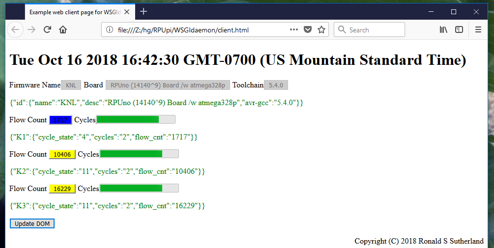

# WSGIdaemon

## ToDo

Test on the R-Pi, so far this has only been used on a Ubuntu 18.04 desktop (using an RPUftdi shield).


## Overview

Web Server Gateway Interface (WSGI) daemon for serial

The idea is to use the gateway to convert an HTTP request into a command for the serial link, the commands I use resemble "/0/id?". The second character is an address on the serial bus (it is a multi-drop), the command is "id", and the "?" means it is a query.

The daemon has now been set to allow the origin to be from everywhere, which means Cross-Origin Resource Sharing (CORS) does not need turned off in the browser. The reference I used to do this is over seven years old so if someone has a better idea please add an issue and suggest.


## Startup

run at a terminal command line

```
python3 WSGIdaemon.py
```

run in background

```
python3 WSGIdaemon.py &
exit 0
```

run at startup, place the script in /home/my_user_name/bin and make it executable, then tell the system to run it from /etc/rc.local

```
[su my_user_name]
[mkdir bin]
cd bin
wget https://raw.githubusercontent.com/epccs/RPUpi/master/WSGIdaemon/WSGIdaemon.py
chmod ugo+x WSGIdaemon.py
sudo nano /etc/rc.local
```

Follow these rc.local [recommendations].

[recommendations]: https://www.raspberrypi.org/documentation/linux/usage/rc-local.md

To stop the daemon

```
ps aux | grep 'WSGIdaemon'
# the number in second column is the WSGIdaemon-pid
kill -TERM [WSGIdaemon-pid]
# if wsgiref.simple_server.make_server.serve_forever has ignored it
kill -KILL [WSGIdaemon-pid]
```


## Browser as Client

Place URL in a browser (the host I have the WSGIdaemon running on is at 192.168.0.7)

```
http://192.168.0.7:8000/?addr=0&cmd=id&q=true
```

Which sends the command "/0/id?" and I get back this JSON from a board on my test bench.

```
{"id":{"name":"I2Cdebug^1","desc":"RPUno (14140^9) Board /w atmega328p","avr-gcc":"5.4.0"}}
```

Now with arguments (arg1..arg5) have added.

```
http://192.168.0.7:8000/?addr=0&cmd=iaddr&q=false&arg1=41
```

Which sends the command "/0/iaddr 41" and I get back this JSON. 

```
{"address":"0x29"}
```

That is the bus manager I2C address (an I2C slave) on the RPUftdi (same for RPUadpt and RPUpi) shield mounted on the RPUno.  The RPUno is running [i2c-debug] software.

[i2c-debug]: https://github.com/epccs/RPUno/tree/master/i2c-debug

Next open the "client.html" file as a flat stand-alone HTML sourced from the disk with Edge, Chrome, or Firefox. Make sure to modify the HTML file so that the correct host address is used (e.g. it has to match the WSGIdaemon host.



the blue button is from cycle_state, which means the irrigation valve is flowing. The flow count is updated as the cycle_state machine advances. The solenoid control cycle_states that are normally reported are 0,4, and 11 but others can show up and that would be like winning the lottery.

https://github.com/epccs/RPUno/blob/028b808fae9b6b1022a0e60a702f900a3815a00d/Solenoid/solenoid.c#L791


## Python as Client

A quick look at Python as the client.

https://2.python-requests.org//en/master/

```Python
#!/usr/bin/env python3
import requests

r = requests.get('http://192.168.0.7:8000/?addr=1&cmd=id&q=true')
if (r.status_code == 200):
    print( str(r.json()) )
    print( "id.name=" + str(r.json()["id"]["name"]))
```

WSGIdaemon turns "?addr=1&cmd=id&q=true" into "/1/id?" and sends that to the AVR. The AVR sends back a JSON reply: {'id': {'name': 'KNL', 'desc': 'RPUno (14140^9) Board /w atmega328p', 'avr-gcc': '5.4.0'}}, which the WSGIdaemon sends back, and requests can turn the json right into a dictionary.


## WSGI Python Referance

[PEP-3333] is a good overview, it is important to read things like that when encode and decode have pushed the wrong buttons. It is unbelievable that this stuff works at all. 

[PEP-3333]: https://www.python.org/dev/peps/pep-3333/

* For WSGI see https://docs.python.org/3.7/library/wsgiref.html
* For CGI see https://docs.python.org/3.7/library/cgi.html


## WSGI Python Frameworks (more referance)

It is not clear to me what these frameworks do, or if thay can act as a serial device gateway.

* For Flask see https://github.com/pallets/flask
* For Bottle see https://github.com/bottlepy/bottle

Flask has a lot a [documentation] and that is probably what I need to use it. If I do work on such a project I will start a separate repository for it. 

[documentation]: https://palletsprojects.com/p/flask/


## WSGI and Cross-Origin Resource Sharing (CORS)

Modern web browsers have implemented the W3C standard [CORS] that allows the browser to have a same-origin policy. This policy means the browser will only allow callbacks from URL's inside a page that has the same origin (scope), that is they have identical schemes, hosts, and ports ([RFC 6454]).

[CORS]: https://www.w3.org/TR/cors/
[RFC 6454]: https://tools.ietf.org/html/rfc6454

* Microsoft notes https://docs.microsoft.com/en-us/aspnet/core/security/cors?view=aspnetcore-2.1
* Mozilla notes https://developer.mozilla.org/en-US/docs/Web/HTTP/CORS
* Google notes https://cloud.google.com/storage/docs/cross-origin

CORS can be turned off in Firefox with this extension (check if a callback works then remove it)

* Cors Everywhere https://github.com/spenibus/cors-everywhere-firefox-addon

