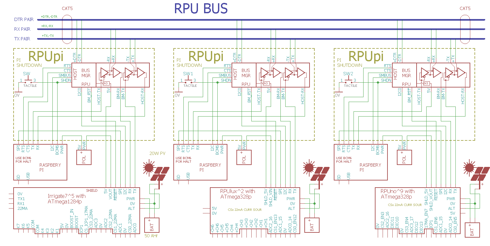

# RPUpi

From <https://github.com/epccs/RPUpi>

## Overview

Shield used to connect a Raspberry Pi Zero (or W) to serial that can be shared (multidrop). The targets presently available are [RPUno], [RPUlux], and [Irrigate7]. The hardware allows the bus to be controlled so the host sees a single target (for bootload) or any number of them.  

A [RPUadpt] shield is also available if the host SBC does not use the Raspberry Pi 40 pin header.

[RPUno]: https://github.com/epccs/RPUno
[RPUlux]: https://github.com/epccs/RPUlux
[Irrigate7]: https://github.com/epccs/Irrigate7
[RPUadpt]: https://github.com/epccs/RPUadpt
[RPUftdi]: https://github.com/epccs/RPUftdi

[Forum](https://rpubus.org/bb/viewforum.php?f=8)

## Status

[Available](https://rpubus.org/Order_Form.html)


## [Hardware](./Hardware)

Hardware files include schematic and board images, bill of materials, and my notes on testing, evaluation, and schooling.

## Example

Both the SBC and microcontroller(s) can run simple UART serial communication software (e.g. all the RS232 software I have tried seems to work). I prefer textual commands, so my examples generally use a textual command processor which echoes back the command like an interactive terminal, the commands are used by the firmware command processor to run routines or configure state machines on the bare metal microcontrollers. The SBC host the toolchain so it can compile the firmware from the source which can be managed with git (e.g. GitHub, GitLab...) or anyway the user wishes. The toolchains uploader can be used to send the firmware to the targets bootloader. The result is one or more bare metal targets can receive updates that are compiled from source without the need for a bare metal network stack. This is not an IoT system, it is a computer hosting an operating system and toolchain connected with physical wires to bare metal embedded controllers. It is also not dependent on any cloud-based services.



To bootload the AVR from the Raspberry Pi hardware serial port it needs to be enabled for [serial] so Linux can use the port, also the [RTS and CTS] pin functions should be enabled since nRTS is used to start the bootloader (in place of the nDTR trick used by an Arduino Uno). 

[serial]: ./Hardware/Testing/linux.md#serial
[RTS and CTS]: ./RPiRtsCts

The Pi Zero also needs a way to [halt] from a push button. When the RPUpi shield is mounted on a target board (e.g. [RPUno]) the VIN pin can be powered off with a [power management] technique.  This allows a manual shutdown and for the local target to request a halt using an I2C command. It should help with redundancy techniques, so two or more SBC's with [failover] can ensure data from the targets keep flowing. 

[failover]: https://en.wikipedia.org/wiki/Failover
[halt]: ./Shutdown
[power management]: https://github.com/epccs/RPUno/tree/master/PwrMgt

## AVR toolchain

The core files for this boards bus manager are in the /lib folder. Each example has its files and a Makefile in its own folder. The toolchain packages that I use are available on Ubuntu and Raspbian. 

```
sudo apt-get install git make gcc-avr binutils-avr gdb-avr avr-libc avrdude
git clone https://github.com/epccs/RPUpi
```

* [gcc-avr](https://packages.ubuntu.com/search?keywords=gcc-avr)
* [binutils-avr](https://packages.ubuntu.com/search?keywords=binutils-avr)
* [gdb-avr](https://packages.ubuntu.com/search?keywords=gdb-avr)
* [avr-libc](https://packages.ubuntu.com/search?keywords=avr-libc)
* [avrdude](https://packages.ubuntu.com/search?keywords=avrdude)